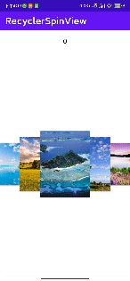

# 效果演示



# 基本使用

RecyclerSpinView 以单一组件的形式实现，但尚未上传到 Maven。需要使用可以将 SpinView 的代码 Clone 下来，并修改对应的 gradle 文件。下面是两种简单的使用 RecyclerSpinView  的方法。

方式一：xml 加入

```xml
    <com.xxx.spinview.RecyclerSpinView
        android:id="@+id/list"
        android:layout_width="match_parent"
        android:layout_height="match_parent"
    </com.xxx.spinview.RecyclerSpinView>
```

方式二：Activity 中初始化，

```Java
    mList = findViewById(R.id.list);
    mList.setAdapter(new Adapter(this));
    mList.setOnItemSelectedListener(new CoverFlowLayoutManger.OnSelected() {
        @Override
        public void onItemSelected(int position) {
            ((TextView)findViewById(R.id.index)).setText((position+1)+"/"+mList.getLayoutManager().getItemCount());
        }
    });
```


# 参考

- [https://qijian.blog.csdn.net/article/details/50995268](https://qijian.blog.csdn.net/article/details/50995268)
- [https://blog.csdn.net/qq_38237224/article/details/120251325](https://blog.csdn.net/qq_38237224/article/details/120251325)
